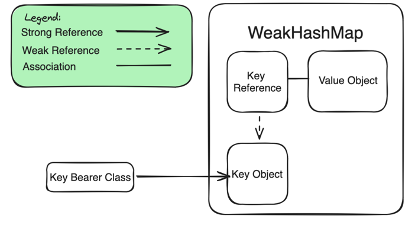

# WeakHashMap for Kotlin Multiplatform

WeakHashMap is a key-value data structure, where value gets deallocated after the key is
deallocated.
This data structure could come in handy, if you have short-lived objects to store in a Cache.

### Getting Started

At the moment the project is targeting Apple platforms and JVM.

1. Add Maven Central to the list of your repositories

``
repositories { mavenCentral() }
``

2. Add WeakHashMap as a dependency where it is required

``
implementation("io.github.alongotv:kotlin-multiplatform-weakhashmap:$version")
``

### Usage

1. Declare a variable containing the map. There is a number of ways to do that:

``
val intsToStringsMap = weakHashMapOf<Int, String>()
``

``
val anyToAnyMap = WeakHashMap<Any, Any>()
``

``
val implicitDoubleToStringMap = weakHashMapOf(2.0 to "kotlin")
``

2. Call WeakHashMap functions (they also support operator calls) to populate the data structure with
   data like you would do with stdlib HashMap.

This code block will print "4":
<pre>
val intsToIntsMap = weakHashMapOf&lt;Int, Int&gt;()
intsToIntsMap[2] = 3
intsToIntsMap.set(2, 4)
println(intsToIntsMap[2])
</pre>

### About

This is a substitute to be used until [ticket](https://youtrack.jetbrains.com/issue/KT-48075) for
adding WeakHashMap to Kotlin's stdlib is resolved.

The scheme below shows an approximate architecture of
the WeakHashMap.

When **Key Bearer Class** is collected by Garbage Collector, the **Key Object** and **Value Object**
will get removed from WeakHashMap and deallocated too, provided
that **Key Object** has not been retained by some other object.
